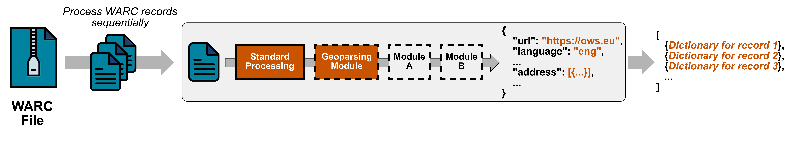

# Parsing
This directory contains the core of Resilipipe, the WARC parsing. Each record in a WARC file is processed sequentially 
in a modular fashion as illustrated below. Each WARC file is turned into a list of dictionaries corresponding to the records it contains.

## Standard Processing
First, a set of standard processing steps is applied to each record. 
These are contained in [warc_preprocessing.py](warc_preprocessing.py) and produce output such as
  - Plain text and language of a web page
  - Microdata and JSON-LD
  - Information from the WARC- and HTTP-Headers like MIME-type and charset

## Modular Processing
Building on the results from the standard processing steps, more extensive parsing is handled by the parsing [modules](./modules).
Modules can be added and removed from the pipeline using the configuration file [modules.yaml](../conf/modules.yaml).
The order of modules in the configuration file defines the order of processing in the pipeline. 
This is important to consider in cases where the output of one module is the input of another (See `PostProcessingModule` below).

### Developing New Modules
A central advantage of designing the pipeline in a modular fashion is that everyone can contribute new modules.
If you want to develop your own module, simply implement one of the abstract classes defined in [abstract.py](modules/abstract.py). 

**Note: All modules and their input (`Module.load_input()`) must be serializable.**

#### Module Classes 
The classes differ in their position in the pipeline, their input parameters, and the types of records they are applied to.
The table below gives an overview on the classes:

| Module Class           | Input parameters                                                                         | Position in the pipeline                                                                                               |
|------------------------|------------------------------------------------------------------------------------------|------------------------------------------------------------------------------------------------------------------------|
| `BasicModule`          | `record_dict`: Dictionary with data from the HTTP and WARC headers                       | At the beginning of the pipeline, after parsing HTTP and WARC headers; Applied to all records                          |
| `HTMLModule`           | `tree: HTMLTree, plain_text: str, language: str, json_ld: Sequence, microdata: Sequence` | After parsing the HTML and microdata/JSON-LD; Applied only to records with MIME-type `text/html`                       |
| `PostProcessingModule` | `record_dict`: Dictionary with data from all previous processing steps                   | At the end of the pipeline; Order depends on the order in [modules.yaml](../conf/modules.yaml); Applied to all records |

#### Class Methods
Each `Module`-class needs to implement the following static methods (`@staticmethod`):

| Method                | Description                                                                                                                                                                                                                                                                   |
|-----------------------|-------------------------------------------------------------------------------------------------------------------------------------------------------------------------------------------------------------------------------------------------------------------------------|
| `prepare`             | Prepare the module when first deploying the pipeline. This will be called everytime [prepare.sh](../../../scripts/prepare.sh) is run.  <i>[Example](./modules/curlielabels.py): Download resources that stay the same between runs of the pipeline.</i>                   |
| `load_input`          | Load data or instantiate classes that are the same for all records to be processed. Return them as a dictionary with `{VARIABLE_NAME: DATA}` to be used by the `process_record` function.  <i>If your module does not need prepared data, return an empty dictionary.</i> | 
| `process_record`      | Take inputs defined by the module class. Return the result(s) of your module as a dictionary of `{COLUMN_NAME: OUTPUT}`.  <i>Empty output should be returned as `{COLUMN_NAME: None}`</i>.                                                                                |
| `get_spark_schema`    | Return a list of `StructField` elements with field name and [Pyspark data type](https://spark.apache.org/docs/latest/sql-ref-datatypes.html) for each return column of the module.                                                                                            |
| `get_pyarrow_schema`  | Return a list of `pa.field` with column name and [Pyarrow data type](https://arrow.apache.org/docs/python/api/datatypes.html) for each return column of the module                                                                                                            |

#### Add your module
After implementing your module using one of the abstract classes in [abstract.py](modules/abstract.py), you can add it to the pipeline by 
1. Adding the `MODULE.py` to the [modules](modules) directory 
2. Putting the name of the module-file (without `.py`) into [modules.yaml](../conf/modules.yaml)

These steps are illustrated for [links.py](modules/links.py) and [collection_indices](modules/collection_indices.py).